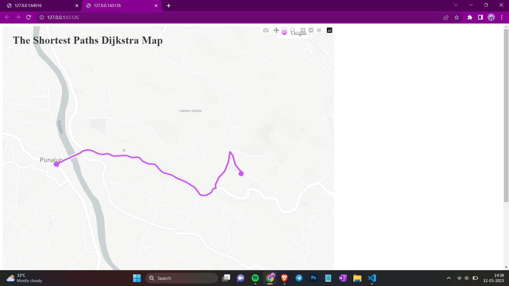
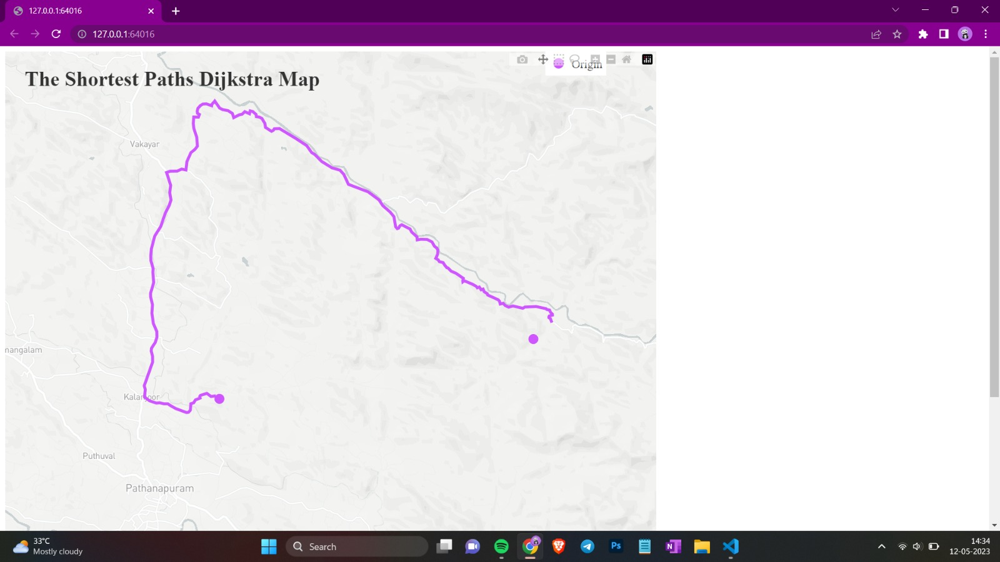
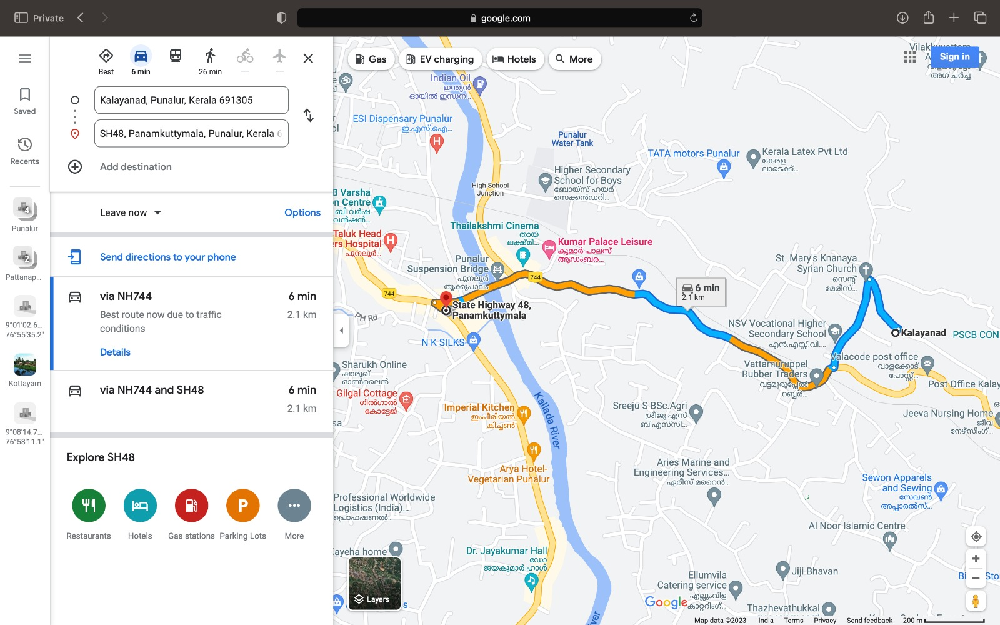

# Shortest Path Visualization with Dijkstra's Algorithm

This repository contains a Python script to visualize the shortest path between two geographical coordinates on a road network using Dijkstra's algorithm. The script uses various libraries, including NetworkX, Plotly, and OSMnx, to fetch road network data, calculate the shortest path, and display it on a map.

## Table of Contents

- Getting Started
  - Prerequisites
  - Installation
- Usage
  - Running the Script
  - Input Format
- Customization
- Example
- License

## Getting Started

### Prerequisites

Before you can use this script, make sure you have the following dependencies installed:

- Python (3.x recommended)
- NetworkX
- Plotly
- OSMnx
- NumPy

You can install these libraries using `pip`

### Installation

1. Clone this repository to your local machine:

2. Change the working directory to the repository:

Now you're ready to use the script.

## Usage

**Running the Script**

To visualize the shortest path between two geographical coordinates, run the script as follows:

The script will prompt you to enter the origin and target coordinates in the format `(latitude, longitude)`. After providing the coordinates, it will generate a map showing the shortest path between them using Dijkstra's algorithm.

**Input Format**

When prompted to enter coordinates, use the following format:

- Origin coordinates: `(latitude, longitude)`
- Target coordinates: `(latitude, longitude)`

For example:

**Customization**

You can customize the script's behavior by adjusting the following parameters in the `shortest_path.py` script:

- `perimeter`: Defines the boundary of the roadmap. Adjust this value to control the area covered by the road network.

- `mode`: Specifies the mode of travel (e.g., 'drive', 'bike', 'walk').

- Mapbox access token: Replace the empty string `mapbox_accesstoken` with your Mapbox access token to use custom map styles.

## Example

You can find an example of how to use this script in the [Example](/example) directory. It includes sample input and output.

### Result Comparison

#### Result from Script:

Result 1:

Result 2:

#### Result from Google Maps:

GMap Result 1:

GMap Result 2:

